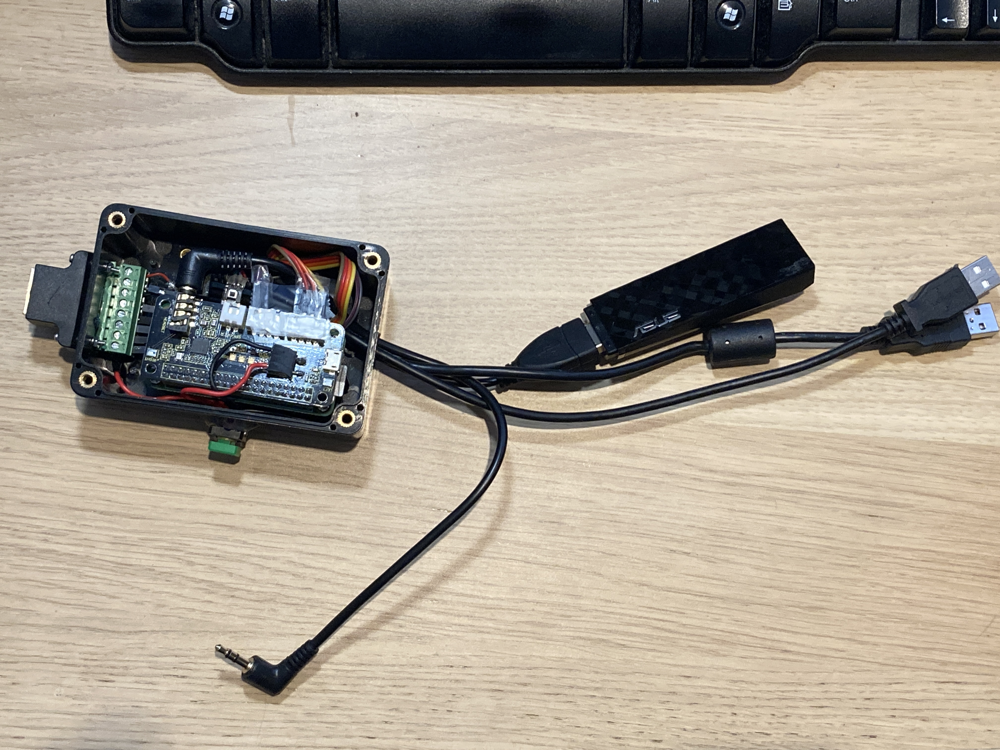
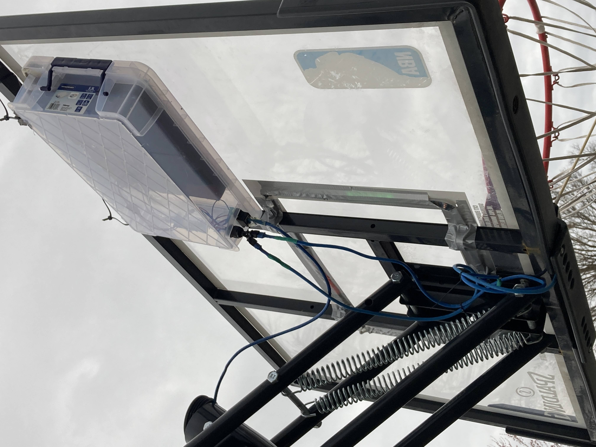
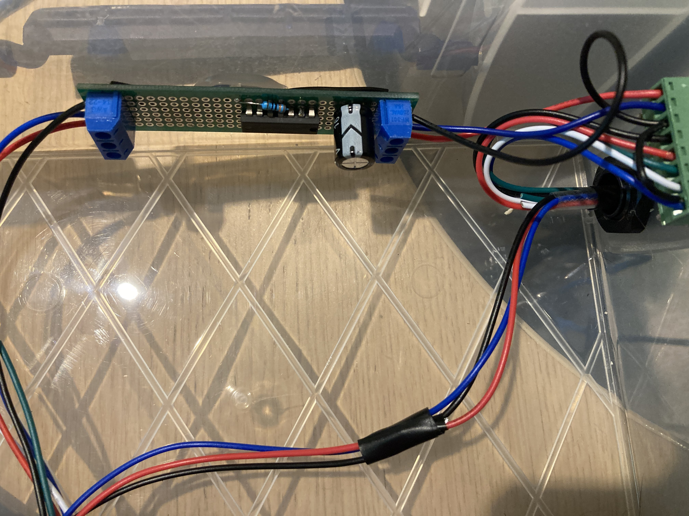
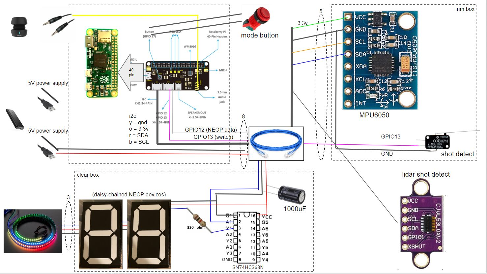

# hoopitup
raspberry pi project. add-on to driveway basketball hoop<BR>









<BR> Demo Video <BR>
<a href="https://www.youtube.com/shorts/Oc8pmvkcobQ"></a>


https://learn.adafruit.com/adafruit-neopixel-uberguide/best-practices
https://learn.adafruit.com/neopixels-on-raspberry-pi/raspberry-pi-wiring

https://lindevs.com/install-github-cli-on-raspberry-pi/<BR>
goto github profile->settings->developer settings->personal access tokens->generate new token->select 'repo'<BR>
```
GITHUB_CLI_VERSION=$(curl -s "https://api.github.com/repos/cli/cli/releases/latest" | grep -Po '"tag_name": "v\K[0-9.]+')
curl -Lo gh.deb "https://github.com/cli/cli/releases/latest/download/gh_${GITHUB_CLI_VERSION}_linux_armv6.deb"
sudo dpkg -i gh.deb
gh --version
rm -rf gh.deb
gh auth login
```
follow prompts, paste token, select 'yes' to log into git.

anker powercore 20100: 20100 mAh / 72.36 wh ; Output : 5V / 4.8A
4.8A can power ~50 neopixels

https://www.amazon.ca/38800mAh-Display-Portable-Charging-Compatible/dp/B09PZV62V3/ref=sr_1_5?crid=1TBF57JE1DSEF&keywords=power+bank&qid=1646747404&sprefix=powerbank%2Caps%2C243&sr=8-5
4 2.1A USB ports: 1 for raspi, 3 other for combined 6.3A (70 neopixels)

https://www.digikey.ca/en/products/detail/sparkfun-electronics/COM-08530/5684342
this 7 segment display is interesting (would need a 8bit shift register for each as well).
But we can also use neopixels if we make custom plastic like here (arguably cheaper and simpler design)
https://learn.adafruit.com/ninja-timer-giant-7-segment-display/overview
https://www.amazon.ca/gp/product/B08JGP969X/ref=crt_ewc_img_dp_1?ie=UTF8&smid=A3DWYIK6Y9EEQB&th=1
https://www.amazon.ca/gp/product/B07XCND8ZJ/ref=crt_ewc_img_dp_4?ie=UTF8&psc=1&smid=A2PFIQQO7UBV3G


custom 7 segment Display
4 neopixels per segment.
need a little 3" x 0.75" box to encase a segment.
print out digit on sticker https://www.amazon.ca/gp/product/B07XCND8ZJ/ref=ox_sc_act_image_1?smid=A2PFIQQO7UBV3G&psc=1
translucent white outer box

pizero sound w/ externally power 3.5mm speaker
https://www.digikey.ca/en/products/detail/adafruit-industries-llc/4037/9770512
https://www.ihomeaudio.com/ibt72pc/

Keystudio Mic Hat (similar to Adafruit's) https://wiki.keyestudio.com/Ks0314_keyestudio_ReSpeaker_2-Mic_Pi_HAT_V1.0
- this has I2C port and GPIO 12/13 on the grove connectors.
- might have to power everything through this daughter board
  (not sure - had to run the install twice - seems to work powered via pi now)
```
git clone https://github.com/respeaker/seeed-voicecard.git
cd seeed-voicecard/
sudo ./install.sh
(this will update kernel, etc)
sudo raspi-config  (enable SPI interface by default) (for LEDs)
sudo apt-get install mpg123
cd hoopitup
mpg123 audio/kaboom-5.mp3
```

neopixles need GPIO  10,12,18,21 to work
audio hat uses
 - 12,21 for I2S (digital audio)
 - GPIO10 for SPI_MOSI (for LEDs) - so could use this
 - GPIO12 for a grove connector (which we're not using) - so could use this.
11 pins to audio hat is sufficient, freeing up other raspi pins for other things.

# have to use the grove connector on the audio hat to connect motion sensor
https://wiki.seeedstudio.com/Grove_Systin
https://www.electronicwings.com/raspberry-pi/raspberry-pi-i2c
pin 1 - Yellow (for example, SCL on I2C Grove Connectors)
pin 2 - White (for example, SDA on I2C Grove Connectors)
pin 3 - Red - VCC on all Grove Connectors
pin 4 - Black - GND on all Grove Connectors

# motion sensor must be 3.3V
https://learn.adafruit.com/mpu6050-6-dof-accelerometer-and-gyro/pinouts

# detect i2c addresses
sudo apt-get install -y i2c-tools
sudo i2cdetect -y 1
